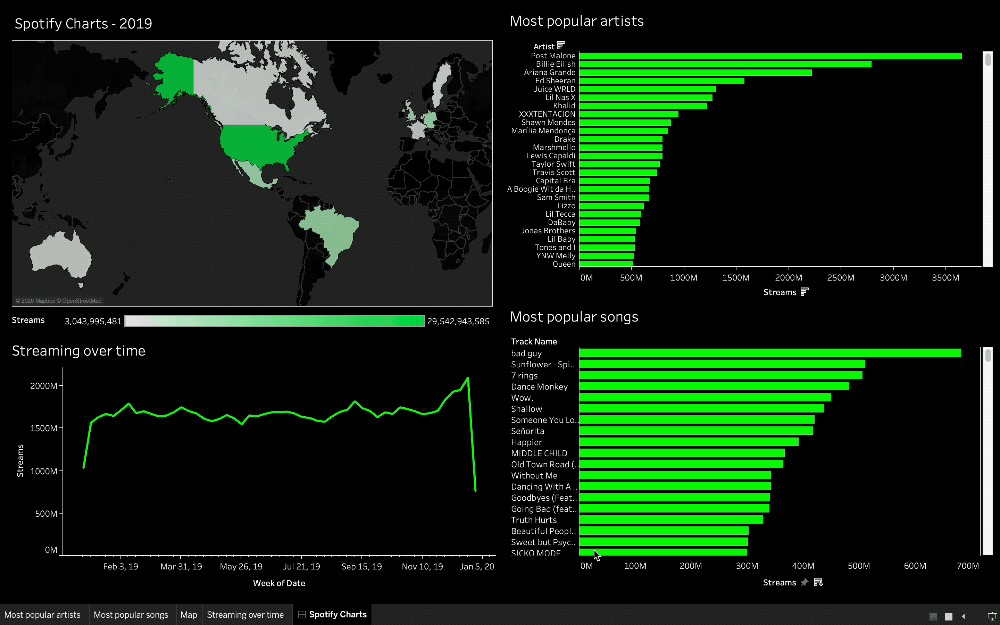

# Spotify Charts Visualization with Tableau

Data gathered from [Spotify Charts](https://spotifycharts.com/) of the top 200 songs daily in 2019, based on country. I used Bash (Unix shell/command line) to handle all the .csv cleaning, manipulation, and automation. After adding 'Country' and 'Date' columns, all files were combined and imported to Tableau. Final dataset consists of over 700k data points. 

### Dashboard Preview
